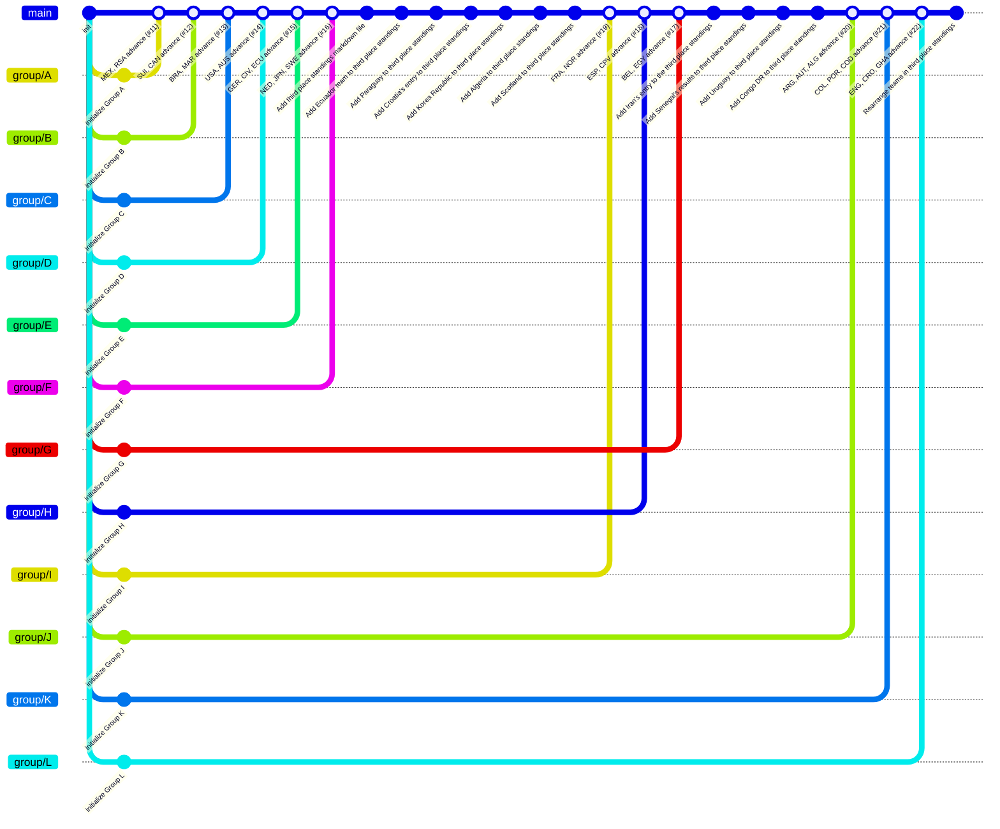

# 🏆 2026 FIFA World Cup in Git

This repository encodes the **2026 FIFA World Cup** as git history.

## How it works

| Branch | Content |
|--------|---------|
| `group/A` … `group/L` | Group stage — each match is a commit updating the standings |
| `teams/TLA` | Created for each of the 32 qualifiers after group stage |
| KO matches | Merge commits — winner's branch absorbs loser's, forming the bracket |
| `main` | Receives the final merge commit when the champion is crowned |

```bash
# View the full tournament bracket as a git graph
git log --graph --oneline --all
```

## Status

- **Stage**: Semi-finals
- **Matches played**: 101 / 104
- **Last updated**: 2026-07-15 21:05 UTC

<details><summary>

## Groups
</summary>

- **Group A**: 6/6 played → `group/A`
- **Group B**: 6/6 played → `group/B`
- **Group C**: 6/6 played → `group/C`
- **Group D**: 6/6 played → `group/D`
- **Group E**: 6/6 played → `group/E`
- **Group F**: 6/6 played → `group/F`
- **Group G**: 6/6 played → `group/G`
- **Group H**: 6/6 played → `group/H`
- **Group I**: 6/6 played → `group/I`
- **Group J**: 6/6 played → `group/J`
- **Group K**: 6/6 played → `group/K`
- **Group L**: 6/6 played → `group/L`

### GitGraph — Group Stage (Snapshot, mermaid)


</details>

## Knockout Bracket

<details ><summary>

### Round of 32</summary>

- South Africa 0-1 Canada → **CAN**
- Brazil 2-1 Japan → **BRA**
- Germany 4-5 (pen. 3-4) Paraguay → **PAR**
- Netherlands 3-4 (pen. 2-3) Morocco → **MAR**
- Ivory Coast 1-2 Norway → **NOR**
- France 3-0 Sweden → **FRA**
- Mexico 2-0 Ecuador → **MEX**
- England 2-1 Congo DR → **ENG**
- Belgium 3-2 Senegal → **BEL**
- USA 2-0 Bosnia-H. → **USA**
- Spain 3-0 Austria → **ESP**
- Portugal 2-1 Croatia → **POR**
- Switzerland 2-0 Algeria → **SUI**
- Australia 3-5 (pen. 2-4) Egypt → **EGY**
- Argentina 3-2 Cape Verde → **ARG**
- Colombia 1-0 Ghana → **COL**
</details>

<details ><summary>

### Round of 16</summary>

- Canada 0-3 Morocco → **MAR**
- Paraguay 0-1 France → **FRA**
- Brazil 1-2 Norway → **NOR**
- Mexico 2-3 England → **ENG**
- Portugal 0-1 Spain → **ESP**
- USA 1-4 Belgium → **BEL**
- Argentina 3-2 Egypt → **ARG**
- Switzerland 4-3 (pen. 4-3) Colombia → **SUI**
</details>

<details ><summary>

### Quarter-finals</summary>

- France 2-0 Morocco → **FRA**
- Spain 2-1 Belgium → **ESP**
- Norway 1-2 England → **ENG**
- Argentina 3-1 Switzerland → **ARG**
</details>

<details open><summary>

### Semi-finals</summary>

- France 0-2 Spain → **ESP**
</details>


### GitGraph — KO Stage (mermaid)

```mermaid
---
config:
  gitGraph:
    parallelCommits: true
---
gitGraph LR:
  commit id: "init"
  branch teams/GER order: 101
  checkout main
  branch teams/PAR order: 102
  checkout main
  branch teams/FRA order: 151
  checkout main
  branch teams/SWE order: 152
  checkout main
  branch teams/RSA order: 201
  checkout main
  branch teams/CAN order: 202
  checkout main
  branch teams/NED order: 251
  checkout main
  branch teams/MAR order: 252
  checkout main
  branch teams/POR order: 301
  checkout main
  branch teams/CRO order: 302
  checkout main
  branch teams/ESP order: 351
  checkout main
  branch teams/AUT order: 352
  checkout main
  branch teams/USA order: 401
  checkout main
  branch teams/BIH order: 402
  checkout main
  branch teams/BEL order: 451
  checkout main
  branch teams/SEN order: 452
  checkout main
  branch teams/BRA order: 501
  checkout main
  branch teams/JPN order: 502
  checkout main
  branch teams/CIV order: 551
  checkout main
  branch teams/NOR order: 552
  checkout main
  branch teams/MEX order: 601
  checkout main
  branch teams/ECU order: 602
  checkout main
  branch teams/ENG order: 651
  checkout main
  branch teams/COD order: 652
  checkout main
  branch teams/ARG order: 701
  checkout main
  branch teams/CPV order: 702
  checkout main
  branch teams/AUS order: 751
  checkout main
  branch teams/EGY order: 752
  checkout main
  branch teams/SUI order: 801
  checkout main
  branch teams/ALG order: 802
  checkout main
  branch teams/COL order: 851
  checkout main
  branch teams/GHA order: 852
  checkout main
  checkout teams/ENG
  commit id: "England advances to Round of 32"
  checkout teams/COD
  commit id: "Congo DR advances to Round of 32"
  commit id: "COD exits at Round of 32"
  checkout teams/ENG
  merge teams/COD id: "ENG advances to Round of 16"
  checkout teams/MEX
  commit id: "Mexico advances to Round of 32"
  checkout teams/ECU
  commit id: "Ecuador advances to Round of 32"
  commit id: "ECU exits at Round of 32"
  checkout teams/MEX
  merge teams/ECU id: "MEX advances to Round of 16"
  commit id: "MEX exits at Round of 16"
  checkout teams/ENG
  merge teams/MEX id: "ENG advances to Quarter-finals"
  checkout teams/NOR
  commit id: "Norway advances to Round of 32"
  checkout teams/CIV
  commit id: "Ivory Coast advances to Round of 32"
  commit id: "CIV exits at Round of 32"
  checkout teams/NOR
  merge teams/CIV id: "NOR advances to Round of 16"
  checkout teams/BRA
  commit id: "Brazil advances to Round of 32"
  checkout teams/JPN
  commit id: "Japan advances to Round of 32"
  commit id: "JPN exits at Round of 32"
  checkout teams/BRA
  merge teams/JPN id: "BRA advances to Round of 16"
  commit id: "BRA exits at Round of 16"
  checkout teams/NOR
  merge teams/BRA id: "NOR advances to Quarter-finals"
  commit id: "NOR exits at Quarter-finals"
  checkout teams/ENG
  merge teams/NOR id: "ENG advances to Semi-finals"
  checkout teams/ARG
  commit id: "Argentina advances to Round of 32"
  checkout teams/CPV
  commit id: "Cape Verde advances to Round of 32"
  commit id: "CPV exits at Round of 32"
  checkout teams/ARG
  merge teams/CPV id: "ARG advances to Round of 16"
  checkout teams/EGY
  commit id: "Egypt advances to Round of 32"
  checkout teams/AUS
  commit id: "Australia advances to Round of 32"
  commit id: "AUS exits at Round of 32"
  checkout teams/EGY
  merge teams/AUS id: "EGY advances to Round of 16"
  commit id: "EGY exits at Round of 16"
  checkout teams/ARG
  merge teams/EGY id: "ARG advances to Quarter-finals"
  checkout teams/SUI
  commit id: "Switzerland advances to Round of 32"
  checkout teams/ALG
  commit id: "Algeria advances to Round of 32"
  commit id: "ALG exits at Round of 32"
  checkout teams/SUI
  merge teams/ALG id: "SUI advances to Round of 16"
  checkout teams/COL
  commit id: "Colombia advances to Round of 32"
  checkout teams/GHA
  commit id: "Ghana advances to Round of 32"
  commit id: "GHA exits at Round of 32"
  checkout teams/COL
  merge teams/GHA id: "COL advances to Round of 16"
  commit id: "COL exits at Round of 16"
  checkout teams/SUI
  merge teams/COL id: "SUI advances to Quarter-finals"
  commit id: "SUI exits at Quarter-finals"
  checkout teams/ARG
  merge teams/SUI id: "ARG advances to Semi-finals"
  checkout teams/ESP
  commit id: "Spain advances to Round of 32"
  checkout teams/AUT
  commit id: "Austria advances to Round of 32"
  commit id: "AUT exits at Round of 32"
  checkout teams/ESP
  merge teams/AUT id: "ESP advances to Round of 16"
  checkout teams/POR
  commit id: "Portugal advances to Round of 32"
  checkout teams/CRO
  commit id: "Croatia advances to Round of 32"
  commit id: "CRO exits at Round of 32"
  checkout teams/POR
  merge teams/CRO id: "POR advances to Round of 16"
  commit id: "POR exits at Round of 16"
  checkout teams/ESP
  merge teams/POR id: "ESP advances to Quarter-finals"
  checkout teams/BEL
  commit id: "Belgium advances to Round of 32"
  checkout teams/SEN
  commit id: "Senegal advances to Round of 32"
  commit id: "SEN exits at Round of 32"
  checkout teams/BEL
  merge teams/SEN id: "BEL advances to Round of 16"
  checkout teams/USA
  commit id: "USA advances to Round of 32"
  checkout teams/BIH
  commit id: "Bosnia-H. advances to Round of 32"
  commit id: "BIH exits at Round of 32"
  checkout teams/USA
  merge teams/BIH id: "USA advances to Round of 16"
  commit id: "USA exits at Round of 16"
  checkout teams/BEL
  merge teams/USA id: "BEL advances to Quarter-finals"
  commit id: "BEL exits at Quarter-finals"
  checkout teams/ESP
  merge teams/BEL id: "ESP advances to Semi-finals"
  checkout teams/FRA
  commit id: "France advances to Round of 32"
  checkout teams/SWE
  commit id: "Sweden advances to Round of 32"
  commit id: "SWE exits at Round of 32"
  checkout teams/FRA
  merge teams/SWE id: "FRA advances to Round of 16"
  checkout teams/PAR
  commit id: "Paraguay advances to Round of 32"
  checkout teams/GER
  commit id: "Germany advances to Round of 32"
  commit id: "GER exits at Round of 32"
  checkout teams/PAR
  merge teams/GER id: "PAR advances to Round of 16"
  commit id: "PAR exits at Round of 16"
  checkout teams/FRA
  merge teams/PAR id: "FRA advances to Quarter-finals"
  checkout teams/MAR
  commit id: "Morocco advances to Round of 32"
  checkout teams/NED
  commit id: "Netherlands advances to Round of 32"
  commit id: "NED exits at Round of 32"
  checkout teams/MAR
  merge teams/NED id: "MAR advances to Round of 16"
  checkout teams/CAN
  commit id: "Canada advances to Round of 32"
  checkout teams/RSA
  commit id: "South Africa advances to Round of 32"
  commit id: "RSA exits at Round of 32"
  checkout teams/CAN
  merge teams/RSA id: "CAN advances to Round of 16"
  commit id: "CAN exits at Round of 16"
  checkout teams/MAR
  merge teams/CAN id: "MAR advances to Quarter-finals"
  commit id: "MAR exits at Quarter-finals"
  checkout teams/FRA
  merge teams/MAR id: "FRA advances to Semi-finals"
  commit id: "FRA exits at Semi-finals"
  checkout teams/ESP
  merge teams/FRA id: "ESP advances to Final"
  checkout main
  commit id: "use '{WTLA} advances to {NEXT_STAGE}' as mer"
```


<details open><summary>

## Git Log</summary>

```text
* d406d49 chore: update results (2026-07-15)
* 0529c1b chore: update results (2026-07-15)
* 231b61a chore: update results (2026-07-14)
* 3a02357 chore: update results (2026-07-14)
* 14de13d chore: update results (2026-07-14)
* 219362d chore: update results (2026-07-12)
* 1928723 chore: update results (2026-07-12)
* 20eaf8d chore: update results (2026-07-12)
* 2d78cde chore: update results (2026-07-12)
* fe59630 chore: update results (2026-07-12)
* dd2a922 chore: update results (2026-07-10)
* 5758c95 chore: update results (2026-07-10)
* ea30c67 chore: update results (2026-07-10)
* ecce1e4 chore: update results (2026-07-09)
* 3283138 chore: update results (2026-07-07)
* 1ce83fe Change penalty score retrieval to fullTime
* 446aed3 chore: update results (2026-07-07)
* 737f596 chore: update results (2026-07-07)
* ca63580 chore: update results (2026-07-07)
* e5326b4 chore: update results (2026-07-06)
* f7963e9 chore: update results (2026-07-06)
*   ca30f49 Merge branch 'main' of https://github.com/metaodi/wm-git
|\  
| * 8967924 chore: update results (2026-07-06)
* | b00c831 Fix comparison for stage label
|/  
* 785ea76 FIx stage display
* 4f66b0b chore: update results (2026-07-06)
* 4c78cbf Fix Git log details formatting in update_wc.py
* 955aec3 chore: update results (2026-07-06)
* d93e92d Fix formatting of details and summary tags in update_wc.py
* 09ab11a chore: update results (2026-07-06)
* 94b851f Fix indentation for ending_commit condition
* aceb70e Refactor status and groups display in update_wc.py
* ccc7d81 chore: update results (2026-07-06)
* 7d895ca chore: update results (2026-07-05)
* 58dffe0 chore: update results (2026-07-05)
* 8e2846a chore: update results (2026-07-05)
* 447e953 chore: update results (2026-07-04)
* f4d41cf chore: update results (2026-07-04)
* 14dd158 chore: update results (2026-07-03)
* 4951602 chore: update results (2026-07-03)
* bc3f620 chore: update results (2026-07-03)
* 395e428 chore: update results (2026-07-03)
* 894d63c chore: update results (2026-07-03)
* e1a8ec7 chore: update results (2026-07-03)
* b8144ed chore: update results (2026-07-03)
* 2bf19fc chore: update results (2026-07-03)
*   a6e491a Exclude git tags from Mermaid gitgraph output (#32)
|\  
| * fe37b87 Filter out git tags from mermaid gitgraph generation
|/  
* ecd85ce chore: update results (2026-07-03)
* 2a1827a chore: update results (2026-07-03)
* 82b85d7 chore: update results (2026-07-02)
* bdd9e3b chore: update results (2026-07-01)
* b9bfce5 chore: update results (2026-07-01)
* d9df1ce chore: update results (2026-07-01)
* f0ca2bd chore: update results (2026-07-01)
* 3a54a4e chore: update results (2026-06-30)
* bab3a2d chore: update results (2026-06-30)
* 574bada chore: update results (2026-06-30)
* 0e1d5bf Filter commit for GitGraph
* a5e98d7 chore: update results (2026-06-30)
* 812fbe8 chore: update results (2026-06-29)
* 2ebd9c9 chore: update results (2026-06-29)
* 8b3ad41 chore: update results (2026-06-29)
* de4586a Fix JSON formatting for ko_branch_order key
* 047874d Fix JSON syntax for ko_branch_order
* 2655ecd Update state.json
* 98494e2 chore: update results (2026-06-29)
* abc67c0 Add uv and dotenv
* 3efc4bc chore: update results (2026-06-29)
*   f776e78 fix: keep full subject in gitgraph when commit message has no colon prefix (#30)
|\  
| * 1c2e59b fix: keep full subject in gitgraph when commit message has no colon prefix
* | e50a935 chore: update results (2026-06-28)
* | 861a5a9 chore: update results (2026-06-28)
* | 95fd91e fix: reset staged index when KO merge fails without entering conflict state (#29)
|\| 
| * 65d1e26 feat: use '{WTLA} advances to {NEXT_STAGE}' as merge commit message
| * fd8ae0d refactor: commit winner file before merge instead of staging it pre-merge
| * 55ecc6b fix: reset staged index when KO merge fails without entering conflict state
* | 06ea7d8 Remove idempotency check for commit existence
* | e6202aa Fix formatting in state.json
* | 51850dc Add merged groups D to L in state.json
* | 3c35299 chore: update results (2026-06-28)
|/  
* 1804e17 chore: update results (2026-06-28)
*   cb138d9 fix: sort KO bracket branches by matchday, add manual order override (#28)
|\  
| * 0f8cd76 feat: sort bracket order by matchday+date, add ko_branch_order override
|/  
* 85f6868 chore: update results (2026-06-28)
* facc459 Enhance debug logging for fetched matches
* c2b9053 chore: update results (2026-06-28)
*   bc27e9a feat: create team branches post-group-stage and order GitGraph by bracket (#27)
|\  
| * 19a1d7b feat: create team branches after group stage and order them by bracket in GitGraph
|/  
* c1b4427 chore: update results (2026-06-28)
* 6b629d8 Add ending_commit field to state.json
* f18185d chore: update results (2026-06-28)
*   6bba9dc feat: bounded commit range for Mermaid GitGraph to preserve group stage snapshot (#26)
|\  
| * b29ac47 fix: address code review feedback on commit range GitGraph feature
| * 73c3da7 feat: support commit range in mermaid GitGraph for group stage snapshot
|/  
* f3c37a8 Update Ghana team status with checkmark
* 8bf4695 Rearrange teams in third place standings
* a6a2976 Update standings in third_place.md
* 5d5cd1b chore: update results (2026-06-28)
*   c9b1c6a Group L: ENG, CRO, GHA advance (#22)
|\  
* \   3e29db3 Group K: COL, POR, COD advance (#21)
|\ \  
* \ \   3d49e70 Group J: ARG, AUT, ALG advance (#20)
|\ \ \  
* | | | 122e90f chore: update results (2026-06-28)
* | | | 2c38269 chore: update results (2026-06-27)
* | | | d17b313 Enable parallel commits in gitGraph configuration
* | | | e845a12 Add Congo DR to third place standings
* | | | 1ee9c12 Add Uruguay to third place standings
* | | | a7ed900 Update third_place.md
* | | | d36044a Add Senegal's results to third place standings
* | | | ff1eee7 Add Iran's entry to the third place standings
* | | | fc045de Update group standings and match results
* | | | 66a20dd Mark Paraguay as qualified with a checkmark
* | | |   35e2cf4 Group G: BEL, EGY advance (#17)
|\ \ \ \  
* \ \ \ \   e3bea87 Group H: ESP, CPV advance (#18)
|\ \ \ \ \  
* | | | | | bf25afa chore: update results (2026-06-27)
* | | | | | 0f51768 chore: update results (2026-06-27)
* | | | | |   7cd5b66 Group I: FRA, NOR advance (#19)
|\ \ \ \ \ \  
* | | | | | | 4393b31 chore: update results (2026-06-26)
* | | | | | | 9265497 chore: update results (2026-06-26)
* | | | | | |   aeeb1f6 feat: fullscreen modal for Mermaid GitGraph (#25)
|\ \ \ \ \ \ \  
| * | | | | | | 7ea859d feat: add modal to view mermaid GitGraph larger
|/ / / / / / /  
* | | | | | | 991535c chore: update results (2026-06-26)
* | | | | | | 76c0d15 Update Congo DR entry to Senegal in standings
* | | | | | | 3cbda12 Add new teams and update standings in third_place.md
* | | | | | | 4c2d875 Add checkmarks to teams in standings
* | | | | | | c05297f Add Scotland to third place standings
* | | | | | | a795492 Add Algeria to third place standings
* | | | | | | ca6b833 Add Korea Republic to third place standings
* | | | | | | 78cb5f9 Add Croatia's entry to third place standings
* | | | | | | f8348b0 Add Paraguay to third place standings
* | | | | | | 7293832 chore: update results (2026-06-26)
* | | | | | | c3a80fa Change parallelCommits setting to false
* | | | | | | 622fb7b chore: update results (2026-06-26)
* | | | | | | 4c84768 Fix typo in variable name for commit IDs
* | | | | | | 3279c6c Fix type hint syntax for all_commit_ids variable
* | | | | | | bc49820 Append commit ID to all_commit_ids list
* | | | | | | dddd7fc Fix function definition syntax in update_wc.py
* | | | | | | 332da53 Update update_wc.py
* | | | | | | fd70bea chore: update results (2026-06-26)
* | | | | | | 80722e0 Update update_wc.py
* | | | | | | 2e5027e chore: update results (2026-06-26)
* | | | | | | fe06e7d Update starting_commit in state.json
* | | | | | | 387fa14 chore: update results (2026-06-26)
* | | | | | | 9acabe8 chore: update results (2026-06-26)
* | | | | | | 1ae3674 Update third_place.md
* | | | | | | b48e1cc Add Ecuador team to third place standings
* | | | | | | 701f697 Add third place standings markdown file
* | | | | | | d6351b3 chore: update results (2026-06-26)
* | | | | | |   b2474ad Group F: NED, JPN, SWE advance (#16)
|\ \ \ \ \ \ \  
* \ \ \ \ \ \ \   e2a060a Group E: GER, CIV, ECU advance (#15)
|\ \ \ \ \ \ \ \  
* \ \ \ \ \ \ \ \   6f49e3c Group D: USA, AUS advance (#14)
|\ \ \ \ \ \ \ \ \  
* | | | | | | | | | 8aae2fe chore: update results (2026-06-26)
* | | | | | | | | | 0bd3a04 chore: update results (2026-06-25)
* | | | | | | | | | 9985da4 Update update_wc.py
* | | | | | | | | | 14b7d30 chore: update results (2026-06-25)
* | | | | | | | | |   5d95d20 fix: prevent merging of sibling branches by only following the first … (#24)
|\ \ \ \ \ \ \ \ \ \  
| * | | | | | | | | | 5c03e0c fix: prevent merging of sibling branches by only following the first parent in commit history
|/ / / / / / / / / /  
* | | | | | | | | | 672d35f Update update-results.yml
* | | | | | | | | | e273890 Add debug logging for branches and SHA mapping
* | | | | | | | | | af871da Fix formatting in git_output_cmd command
* | | | | | | | | | 65c5589 Refactor git log commands in update_wc.py
* | | | | | | | | | 2567c42 chore: update results (2026-06-25)
* | | | | | | | | |   234a479 Fix group branches missing from Mermaid GitGraph due to narrow fetch refspec (#23)
|\ \ \ \ \ \ \ \ \ \  
| * | | | | | | | | | 8dba9b3 Remove the merge guessing
| * | | | | | | | | | 0917a6d fix: fetch all remote branches with wildcard refspec in workflow
| * | | | | | | | | | adcc7d8 fix: infer group branch tips from merge commit subjects when branch refs are deleted
|/ / / / / / / / / /  
* | | | | | | | | | 95d2fbb chore: update results (2026-06-25)
* | | | | | | | | | 20bb335 Update state.json
* | | | | | | | | |   1853711 Group C: BRA, MAR advance (#13)
|\ \ \ \ \ \ \ \ \ \  
* \ \ \ \ \ \ \ \ \ \   582cdde Group B: SUI, CAN advance (#12)
|\ \ \ \ \ \ \ \ \ \ \  
* \ \ \ \ \ \ \ \ \ \ \   2601f9a Group A: MEX, RSA advance (#11)
|\ \ \ \ \ \ \ \ \ \ \ \  
* | | | | | | | | | | | | e5c328e chore: update results (2026-06-25)
* | | | | | | | | | | | | 63ecdfc Update update_wc.py
* | | | | | | | | | | | | 2452db4 chore: update results (2026-06-25)
* | | | | | | | | | | | | 09b3863 Update update_wc.py
* | | | | | | | | | | | | 58eaddf Update update_wc.py
* | | | | | | | | | | | | d795d15 chore: update results (2026-06-25)
* | | | | | | | | | | | | 766e2f9 chore: update results (2026-06-24)
* | | | | | | | | | | | | 44b4375 chore: update results (2026-06-24)
* | | | | | | | | | | | | c9ac0a0 Disable scheduled updates for World Cup results
* | | | | | | | | | | | | 3363bd4 chore: update results (2026-06-24)
* | | | | | | | | | | | | 33f3158 chore: update results (2026-06-24)
* | | | | | | | | | | | | 69a9d9b chore: update results (2026-06-24)
* | | | | | | | | | | | | e9982f7 Update update_wc.py
* | | | | | | | | | | | | d97b331 chore: update results (2026-06-24)
* | | | | | | | | | | | | e5a5a17 Add commit id to gitGraph command output
* | | | | | | | | | | | | e1b30f2 chore: update results (2026-06-24)
* | | | | | | | | | | | | ef8924b chore: update results (2026-06-24)
* | | | | | | | | | | | | 9b9ffa2 chore: update results (2026-06-24)
* | | | | | | | | | | | | e8d508e chore: update results (2026-06-23)
* | | | | | | | | | | | | 211ffde Update update_wc.py
* | | | | | | | | | | | | a4c4ecc chore: update results (2026-06-23)
* | | | | | | | | | | | | 0dae92a chore: update results (2026-06-23)
* | | | | | | | | | | | | b4349ce Update state.json
* | | | | | | | | | | | | 28444af chore: update results (2026-06-23)
* | | | | | | | | | | | | 0226e32 Allow display of chore commits in update_wc.py
* | | | | | | | | | | | | 0827645 Update starting_commit in state.json
* | | | | | | | | | | | | e37f30d chore: update results (2026-06-23)
* | | | | | | | | | | | | f027d96 Update starting_commit in state.json
* | | | | | | | | | | | | 9bb0204 chore: update results (2026-06-23)
* | | | | | | | | | | | | c6254c2 Update starting_commit in state.json
* | | | | | | | | | | | | 795f227 chore: update results (2026-06-23)
* | | | | | | | | | | | | 2eb25c8 Update starting_commit to new commit hash
| | | | | | | | | | | | | *   97385e6 ESP advances to Final
| | | | | | | | | | | | | |\  
| | | | | | | | | | | | | | * 4bab9df eliminated: FRA exits at Semi-finals
| | | | | | | | | | | | | | *   b88e8e6 FRA advances to Semi-finals
| | | | | | | | | | | | | | |\  
| | | | | | | | | | | | | | | * ad20c49 eliminated: MAR exits at Quarter-finals
| | | | | | | | | | | | | | | *   8f383a4 MAR advances to Quarter-finals
| | | | | | | | | | | | | | | |\  
| | | | | | | | | | | | | | | | * 7c0271c eliminated: CAN exits at Round of 16
| | | | | | | | | | | | | | | | *   c8473e6 CAN advances to Round of 16
| | | | | | | | | | | | | | | | |\  
| | | | | | | | | | | | | | | | | * 8ea328b eliminated: RSA exits at Round of 32
| | | | | | | | | | | | | | | | | * ad50414 feat: South Africa advances to Round of 32
| | |_|_|_|_|_|_|_|_|_|_|_|_|_|_|/  
| |/| | | | | | | | | | | | | | |   
| | | | | | | | | | | | | | | | * 31f0f6d Round of 32: South Africa 0-1 Canada (2026-06-28)
| | | | | | | | | | | | | | | | * 9e0d65e feat: Canada advances to Round of 32
| | | |_|_|_|_|_|_|_|_|_|_|_|_|/  
| | |/| | | | | | | | | | | | |   
| | | | | | | | | | | | | | | * 1e29076 Round of 16: Canada 0-3 Morocco (2026-07-04)
| | | | | | | | | | | | | | | *   4df302e MAR advances to Round of 16
| | | | | | | | | | | | | | | |\  
| | | | | | | | | | | | | | | | * b108d41 eliminated: NED exits at Round of 32
| | | | | | | | | | | | | | | | * 6f089b1 feat: Netherlands advances to Round of 32
| | | | | | | |_|_|_|_|_|_|_|_|/  
| | | | | | |/| | | | | | | | |   
| | | | | | | | | | | | | | | * 7f486e2 Round of 32: Netherlands 3-4 (pen. 2-2) Morocco (2026-06-30)
| | | | | | | | | | | | | | | * b958ff3 feat: Morocco advances to Round of 32
| | | | |_|_|_|_|_|_|_|_|_|_|/  
| | | |/| | | | | | | | | | |   
| | | | | | | | | | | | | | * a47e146 Quarter-finals: France 2-0 Morocco (2026-07-09)
| | | | | | | | | | | | | | *   567732a FRA advances to Quarter-finals
| | | | | | | | | | | | | | |\  
| | | | | | | | | | | | | | | * ce0fc71 eliminated: PAR exits at Round of 16
| | | | | | | | | | | | | | | *   5505e76 PAR advances to Round of 16
| | | | | | | | | | | | | | | |\  
| | | | | | | | | | | | | | | | * a8fd897 eliminated: GER exits at Round of 32
| | | | | | | | | | | | | | | | * c4373a3 feat: Germany advances to Round of 32
| | | | | | |_|_|_|_|_|_|_|_|_|/  
| | | | | |/| | | | | | | | | |   
| | | | | | | | | | | | | | | * 67ce0af Round of 32: Germany 5-6 (pen. 5-5) Paraguay (2026-06-29)
| | | | | | | | | | | | | | | * 7803851 feat: Paraguay advances to Round of 32
| | | | | |_|_|_|_|_|_|_|_|_|/  
| | | | |/| | | | | | | | | |   
| | | | | | | | | | | | | | * bffaaf1 Round of 16: Paraguay 0-1 France (2026-07-04)
| | | | | | | | | | | | | | *   0bbe564 FRA advances to Round of 16
| | | | | | | | | | | | | | |\  
| | | | | | | | | | | | | | | * 409567c eliminated: SWE exits at Round of 32
| | | | | | | | | | | | | | | * 8b96aa3 feat: Sweden advances to Round of 32
| | | | | | | |_|_|_|_|_|_|_|/  
| | | | | | |/| | | | | | | |   
| | | | | | | | | | | | | | * 4503455 Round of 32: France 3-0 Sweden (2026-06-30)
| | | | | | | | | | | | | | * 4a6c4ef feat: France advances to Round of 32
| | | | | | | | |_|_|_|_|_|/  
| | | | | | | |/| | | | | |   
| | | | | | | | | | | | | * 089b035 Semi-finals: France 0-2 Spain (2026-07-14)
| | | | | | | | | | | | | *   87091c5 ESP advances to Semi-finals
| | | | | | | | | | | | | |\  
| | | | | | | | | | | | | | * 4b9e167 eliminated: BEL exits at Quarter-finals
| | | | | | | | | | | | | | *   893be28 BEL advances to Quarter-finals
| | | | | | | | | | | | | | |\  
| | | | | | | | | | | | | | | * 02e0eae eliminated: USA exits at Round of 16
| | | | | | | | | | | | | | | *   e1d8301 USA advances to Round of 16
| | | | | | | | | | | | | | | |\  
| | | | | | | | | | | | | | | | * 0291cfa eliminated: BIH exits at Round of 32
| | | | | | | | | | | | | | | | * 6bb95d0 feat: Bosnia-H. advances to Round of 32
| | | |_|_|_|_|_|_|_|_|_|_|_|_|/  
| | |/| | | | | | | | | | | | |   
| | | | | | | | | | | | | | | * a3a7c8e Round of 32: USA 2-0 Bosnia-H. (2026-07-02)
| | | | | | | | | | | | | | | * 009956f feat: USA advances to Round of 32
| | | | | |_|_|_|_|_|_|_|_|_|/  
| | | | |/| | | | | | | | | |   
| | | | | | | | | | | | | | * 5bf9fa7 Round of 16: USA 1-4 Belgium (2026-07-07)
| | | | | | | | | | | | | | *   ec8d8e4 BEL advances to Round of 16
| | | | | | | | | | | | | | |\  
| | | | | | | | | | | | | | | * 322b7b2 eliminated: SEN exits at Round of 32
| | | | | | | | | | | | | | | * d3ec69d feat: Senegal advances to Round of 32
| | | | | | | | |_|_|_|_|_|_|/  
| | | | | | | |/| | | | | | |   
| | | | | | | | | | | | | | * 54ca42b Round of 32: Belgium 3-2 Senegal (2026-07-01)
| | | | | | | | | | | | | | * dcbd99c feat: Belgium advances to Round of 32
| | | | | | | | | | |_|_|_|/  
| | | | | | | | | |/| | | |   
| | | | | | | | | | | | | * 43e6c02 Quarter-finals: Spain 2-1 Belgium (2026-07-10)
| | | | | | | | | | | | | *   41bcdcf ESP advances to Quarter-finals
| | | | | | | | | | | | | |\  
| | | | | | | | | | | | | | * 2f31498 eliminated: POR exits at Round of 16
| | | | | | | | | | | | | | *   32e6f40 POR advances to Round of 16
| | | | | | | | | | | | | | |\  
| | | | | | | | | | | | | | | * 665f9ab eliminated: CRO exits at Round of 32
| | | | | | | | | | | | | | | * 17d2671 feat: Croatia advances to Round of 32
| | | | | | | | | | | | | |_|/  
| | | | | | | | | | | | |/| |   
| | | | | | | | | | | | | | * da6fbf7 Round of 32: Portugal 2-1 Croatia (2026-07-02)
| | | | | | | | | | | | | | * 1100b4d feat: Portugal advances to Round of 32
| | | | | | | | | | | | |_|/  
| | | | | | | | | | | |/| |   
| | | | | | | | | | | | | * 9077ed1 Round of 16: Portugal 0-1 Spain (2026-07-06)
| | | | | | | | | | | | | *   fd3a7a2 ESP advances to Round of 16
| | | | | | | | | | | | | |\  
| | | | | | | | | | | | | | * 76e3812 eliminated: AUT exits at Round of 32
| | | | | | | | | | | | | | * 6bb0c4c feat: Austria advances to Round of 32
| | | | | | | | | | | |_|_|/  
| | | | | | | | | | |/| | |   
| | | | | | | | | | | | | * 296649f Round of 32: Spain 3-0 Austria (2026-07-02)
| | | | | | | | | | | | | * 6183468 feat: Spain advances to Round of 32
| | | | | | | | | |_|_|_|/  
| | | | | | | | |/| | | |   
| | | | | | | | | | | | | *   c9b80d0 ARG advances to Semi-finals
| | | | | | | | | | | | | |\  
| | | | | | | | | | | | | | * 35cdeed eliminated: SUI exits at Quarter-finals
| | | | | | | | | | | | | | *   a841ec9 SUI advances to Quarter-finals
| | | | | | | | | | | | | | |\  
| | | | | | | | | | | | | | | * ec8aee3 eliminated: COL exits at Round of 16
| | | | | | | | | | | | | | | *   be1d028 COL advances to Round of 16
| | | | | | | | | | | | | | | |\  
| | | | | | | | | | | | | | | | * 2a9c875 eliminated: GHA exits at Round of 32
| | | | | | | | | | | | | | | | * be71aa7 feat: Ghana advances to Round of 32
| | | | | | | | | | | | | |_|_|/  
| | | | | | | | | | | | |/| | |   
| | | | | | | | | | | | | | | * dad1f15 Round of 32: Colombia 1-0 Ghana (2026-07-04)
| | | | | | | | | | | | | | | * c4fe5ae feat: Colombia advances to Round of 32
| | | | | | | | | | | | |_|_|/  
| | | | | | | | | | | |/| | |   
| | | | | | | | | | | | | | * 089152c Round of 16: Switzerland 4-3 (pen. 3-3) Colombia (2026-07-07)
| | | | | | | | | | | | | | *   931e68b SUI advances to Round of 16
| | | | | | | | | | | | | | |\  
| | | | | | | | | | | | | | | * 47a0b03 eliminated: ALG exits at Round of 32
| | | | | | | | | | | | | | | * 1625e5c feat: Algeria advances to Round of 32
| | | | | | | | | | | |_|_|_|/  
| | | | | | | | | | |/| | | |   
| | | | | | | | | | | | | | * d0810f7 Round of 32: Switzerland 2-0 Algeria (2026-07-03)
| | | | | | | | | | | | | | * f81e0ef feat: Switzerland advances to Round of 32
| | | |_|_|_|_|_|_|_|_|_|_|/  
| | |/| | | | | | | | | | |   
| | * | | | | | | | | | | | 0a60654 Group B, MD3: Bosnia-H. 3-1 Qatar (2026-06-24)
| | * | | | | | | | | | | | c1e4c7e Group B, MD3: Switzerland 2-1 Canada (2026-06-24)
| | * | | | | | | | | | | | 3357170 Group B, MD2: Canada 6-0 Qatar (2026-06-18)
| | * | | | | | | | | | | | 2f0881b Group B, MD2: Switzerland 4-1 Bosnia-H. (2026-06-18)
| | * | | | | | | | | | | | d12dfee Group B, MD1: Qatar 1-1 Switzerland (2026-06-13)
| | * | | | | | | | | | | | 647c3f3 Group B, MD1: Canada 1-1 Bosnia-H. (2026-06-12)
| | * | | | | | | | | | | | 73fea82 feat: initialize Group B
| |/ / / / / / / / / / / /  
|/| | | | | | | | | | | |   
| | | | | | | | | | | | * 9349a77 Quarter-finals: Argentina 3-1 Switzerland (2026-07-12)
| | | | | | | | | | | | *   fe896e2 ARG advances to Quarter-finals
| | | | | | | | | | | | |\  
| | | | | | | | | | | | | * e14977f eliminated: EGY exits at Round of 16
| | | | | | | | | | | | | *   1dc3ab5 EGY advances to Round of 16
| | | | | | | | | | | | | |\  
| | | | | | | | | | | | | | * 192abc0 eliminated: AUS exits at Round of 32
| | | | | | | | | | | | | | * 42b8d83 feat: Australia advances to Round of 32
| | | | |_|_|_|_|_|_|_|_|_|/  
| | | |/| | | | | | | | | |   
| | | * | | | | | | | | | | a0a688a Group D, MD3: Paraguay 0-0 Australia (2026-06-26)
| | | * | | | | | | | | | | 6fa6b3a Group D, MD3: Turkey 3-2 USA (2026-06-26)
| | | * | | | | | | | | | | e28a6dc Group D, MD2: Turkey 0-1 Paraguay (2026-06-20)
| | | * | | | | | | | | | | f307f62 Group D, MD2: USA 2-0 Australia (2026-06-19)
| | | * | | | | | | | | | | d9483dc Group D, MD1: Australia 2-0 Turkey (2026-06-14)
| | | * | | | | | | | | | | 3829793 Group D, MD1: USA 4-1 Paraguay (2026-06-13)
| | | * | | | | | | | | | | da0de21 feat: initialize Group D
| |_|/ / / / / / / / / / /  
|/| | | | | | | | | | | |   
| | | | | | | | | | | | * 215440a Round of 32: Australia 3-5 (pen. 4-4) Egypt (2026-07-03)
| | | | | | | | | | | | * c55e2b9 feat: Egypt advances to Round of 32
| | | | | | | | |_|_|_|/  
| | | | | | | |/| | | |   
| | | | | | | * | | | | 5228e04 Group G, MD3: Egypt 1-2 Iran (2026-06-27)
| | | | | | | * | | | | a8eb1cc Group G, MD3: New Zealand 1-5 Belgium (2026-06-27)
| | | | | | | * | | | | 1aa234b Group G, MD2: New Zealand 1-3 Egypt (2026-06-22)
| | | | | | | * | | | | 9a649da Group G, MD2: Belgium 0-0 Iran (2026-06-21)
| | | | | | | * | | | | 4198b88 Group G, MD1: Iran 2-2 New Zealand (2026-06-16)
| | | | | | | * | | | | 7f1d992 Group G, MD1: Belgium 1-1 Egypt (2026-06-15)
| | | | | | | * | | | | 9ba404e feat: initialize Group G
| |_|_|_|_|_|/ / / / /  
|/| | | | | | | | | |   
| | | | | | | | | | * 0229362 Round of 16: Argentina 3-2 Egypt (2026-07-07)
| | | | | | | | | | *   bcfccf3 ARG advances to Round of 16
| | | | | | | | | | |\  
| | | | | | | | | | | * 39961c8 eliminated: CPV exits at Round of 32
| | | | | | | | | | | * cbdbe9d feat: Cape Verde advances to Round of 32
| | | | | | | |_|_|_|/  
| | | | | | |/| | | |   
| | | | | | * | | | | 6bcba87 Group H, MD3: Cape Verde 0-0 Saudi Arabia (2026-06-27)
| | | | | | * | | | | 936cae0 Group H, MD3: Uruguay 0-1 Spain (2026-06-27)
| | | | | | * | | | | 041ba94 Group H, MD2: Uruguay 2-2 Cape Verde (2026-06-21)
| | | | | | * | | | | 4187777 Group H, MD2: Spain 4-0 Saudi Arabia (2026-06-21)
| | | | | | * | | | | b8d1966 Group H, MD1: Saudi Arabia 1-1 Uruguay (2026-06-15)
| | | | | | * | | | | 0d818f0 Group H, MD1: Spain 0-0 Cape Verde (2026-06-15)
| | | | | | * | | | | ea91a7b feat: initialize Group H
| |_|_|_|_|/ / / / /  
|/| | | | | | | | |   
| | | | | | | | | * 89dde02 Round of 32: Argentina 3-2 Cape Verde (2026-07-03)
| | | | | | | | | * 50d9b3a feat: Argentina advances to Round of 32
| | | | | | | |_|/  
| | | | | | |/| |   
| | | | | | * | | a263387 Group J, MD3: Algeria 3-3 Austria (2026-06-28)
| | | | | | * | | f789e3c Group J, MD3: Jordan 1-3 Argentina (2026-06-28)
| | | | | | * | | 64f56fa Group J, MD2: Jordan 1-2 Algeria (2026-06-23)
| | | | | | * | | a04bce5 Group J, MD2: Argentina 2-0 Austria (2026-06-22)
| | | | | | * | | d62db80 Group J, MD1: Austria 3-1 Jordan (2026-06-17)
| | | | | | * | | 555de8f Group J, MD1: Argentina 3-0 Algeria (2026-06-17)
| | | | | | * | | 26d1524 feat: initialize Group J
| |_|_|_|_|/ / /  
|/| | | | | | |   
| | | | | | | | *   8e30a4c ENG advances to Semi-finals
| | | | | | | | |\  
| | | | | | | | | * 9f8a4ce eliminated: NOR exits at Quarter-finals
| | | | | | | | | *   8a17a8c NOR advances to Quarter-finals
| | | | | | | | | |\  
| | | | | | | | | | * 4f26c72 eliminated: BRA exits at Round of 16
| | | | | | | | | | *   5d7caa6 BRA advances to Round of 16
| | | | | | | | | | |\  
| | | | | | | | | | | * 126b286 eliminated: JPN exits at Round of 32
| | | | | | | | | | | * e07b324 feat: Japan advances to Round of 32
| | | | | |_|_|_|_|_|/  
| | | | |/| | | | | |   
| | | | * | | | | | | 3fb3b66 Group F, MD3: Japan 1-1 Sweden (2026-06-25)
| | | | * | | | | | | d3f08c9 Group F, MD3: Tunisia 1-3 Netherlands (2026-06-25)
| | | | * | | | | | | 37486e3 Group F, MD2: Tunisia 0-4 Japan (2026-06-21)
| | | | * | | | | | | 62cfd94 Group F, MD2: Netherlands 5-1 Sweden (2026-06-20)
| | | | * | | | | | | a3802dd Group F, MD1: Sweden 5-1 Tunisia (2026-06-15)
| | | | * | | | | | | 55a2a87 Group F, MD1: Netherlands 2-2 Japan (2026-06-14)
| | | | * | | | | | | f136fe6 feat: initialize Group F
| |_|_|/ / / / / / /  
|/| | | | | | | | |   
| | | | | | | | | * 43e8655 Round of 32: Brazil 2-1 Japan (2026-06-29)
| | | | | | | | | * 038f852 feat: Brazil advances to Round of 32
| | | |_|_|_|_|_|/  
| | |/| | | | | |   
| | * | | | | | | 1e63230 Group C, MD3: Scotland 0-3 Brazil (2026-06-24)
| | * | | | | | | 914859e Group C, MD3: Morocco 4-2 Haiti (2026-06-24)
| | * | | | | | | 713ade3 Group C, MD2: Brazil 3-0 Haiti (2026-06-20)
| | * | | | | | | 1ea95ac Group C, MD2: Scotland 0-1 Morocco (2026-06-19)
| | * | | | | | | cae8412 Group C, MD1: Haiti 0-1 Scotland (2026-06-14)
| | * | | | | | | 4c1fb49 Group C, MD1: Brazil 1-1 Morocco (2026-06-13)
| | * | | | | | | de0ccc8 feat: initialize Group C
| |/ / / / / / /  
|/| | | | | | |   
| | | | | | | * 21ebeea Round of 16: Brazil 1-2 Norway (2026-07-05)
| | | | | | | *   47ce430 NOR advances to Round of 16
| | | | | | | |\  
| | | | | | | | * 56986eb eliminated: CIV exits at Round of 32
| | | | | | | | * 57a304b feat: Ivory Coast advances to Round of 32
| | | |_|_|_|_|/  
| | |/| | | | |   
| | | | | | | * 155a45b Round of 32: Ivory Coast 1-2 Norway (2026-06-30)
| | | | | | | * 31d39aa feat: Norway advances to Round of 32
| | | | |_|_|/  
| | | |/| | |   
| | | * | | | 5703db8 Group I, MD3: Senegal 5-0 Iraq (2026-06-26)
| | | * | | | c05f27d Group I, MD3: Norway 1-4 France (2026-06-26)
| | | * | | | 5a0f84e Group I, MD2: Norway 3-2 Senegal (2026-06-23)
| | | * | | | 40fce23 Group I, MD2: France 3-0 Iraq (2026-06-22)
| | | * | | | 432ca77 Group I, MD1: Iraq 1-4 Norway (2026-06-16)
| | | * | | | 769feea Group I, MD1: France 3-1 Senegal (2026-06-16)
| | | * | | | a28079d feat: initialize Group I
| |_|/ / / /  
|/| | | | |   
| | | | | * b028305 Quarter-finals: Norway 1-2 England (2026-07-11)
| | | | | *   4522da5 ENG advances to Quarter-finals
| | | | | |\  
| | | | | | * 49ae15f eliminated: MEX exits at Round of 16
| | | | | | *   8a147ed MEX advances to Round of 16
| | | | | | |\  
| | | | | | | * 6a3ae53 eliminated: ECU exits at Round of 32
| | | | | | | * 09d842a feat: Ecuador advances to Round of 32
| | | |_|_|_|/  
| | |/| | | |   
| | * | | | | 1e58c16 Group E, MD3: Curaçao 0-2 Ivory Coast (2026-06-25)
| | * | | | | 3a01352 Group E, MD3: Ecuador 2-1 Germany (2026-06-25)
| | * | | | | 54ae035 Group E, MD2: Ecuador 0-0 Curaçao (2026-06-21)
| | * | | | | fd81778 Group E, MD2: Germany 2-1 Ivory Coast (2026-06-20)
| | * | | | | 7948bbe Group E, MD1: Ivory Coast 1-0 Ecuador (2026-06-14)
| | * | | | | 6256d77 Group E, MD1: Germany 7-1 Curaçao (2026-06-14)
| | * | | | | cd1b6fc feat: initialize Group E
| |/ / / / /  
|/| | | | |   
| | | | | * bf5fd68 Round of 32: Mexico 2-0 Ecuador (2026-07-01)
| | | | | * 447aabb feat: Mexico advances to Round of 32
| | |_|_|/  
| |/| | |   
| * | | | fb7d903 Group A, MD3: South Africa 1-0 Korea Republic (2026-06-25)
| * | | | 1276260 Group A, MD3: Czechia 0-3 Mexico (2026-06-25)
| * | | | f768041 Group A, MD2: Mexico 1-0 Korea Republic (2026-06-19)
| * | | | dbc69ea Group A, MD2: Czechia 1-1 South Africa (2026-06-18)
| * | | | 777a2b6 Group A, MD1: Korea Republic 2-1 Czechia (2026-06-12)
| * | | | 612b691 Group A, MD1: Mexico 2-0 South Africa (2026-06-11)
| * | | | b22d60b feat: initialize Group A
|/ / / /  
| | | * 41cb7a6 Round of 16: Mexico 2-3 England (2026-07-06)
| | | *   a261540 ENG advances to Round of 16
| | | |\  
| | | | * 7d3165d eliminated: COD exits at Round of 32
| | | | * 5672b0b feat: Congo DR advances to Round of 32
| | |_|/  
| |/| |   
| * | | 8744925 Group K, MD3: Congo DR 3-1 Uzbekistan (2026-06-27)
| * | | 3d35870 Group K, MD3: Colombia 0-0 Portugal (2026-06-27)
| * | | f5de9cc Group K, MD2: Colombia 1-0 Congo DR (2026-06-24)
| * | | 6143609 Group K, MD2: Portugal 5-0 Uzbekistan (2026-06-23)
| * | | 03093dc Group K, MD1: Uzbekistan 1-3 Colombia (2026-06-18)
| * | | 9e313b3 Group K, MD1: Portugal 1-1 Congo DR (2026-06-17)
| * | | 682f112 feat: initialize Group K
|/ / /  
| | * acacf83 Round of 32: England 2-1 Congo DR (2026-07-01)
| | * 8b598ba feat: England advances to Round of 32
| |/  
| * e8fed03 Group L, MD3: Croatia 2-1 Ghana (2026-06-27)
| * 475af9c Group L, MD3: Panama 0-2 England (2026-06-27)
| * 7551de5 Group L, MD2: Panama 0-1 Croatia (2026-06-23)
| * 6a430be Group L, MD2: England 0-0 Ghana (2026-06-23)
| * ab54662 Group L, MD1: Ghana 1-0 Panama (2026-06-17)
| * 9709b5e Group L, MD1: England 4-2 Croatia (2026-06-17)
| * 4ece383 feat: initialize Group L
|/  
* ca7d95c chore: update results (2026-06-23)
* 29bcdac chore: update results (2026-06-23)
* 59ccdf1 chore: update results (2026-06-23)
* 2e629c7 chore: update results (2026-06-23)
* 3c96f35 Update update_wc.py
```
</details>