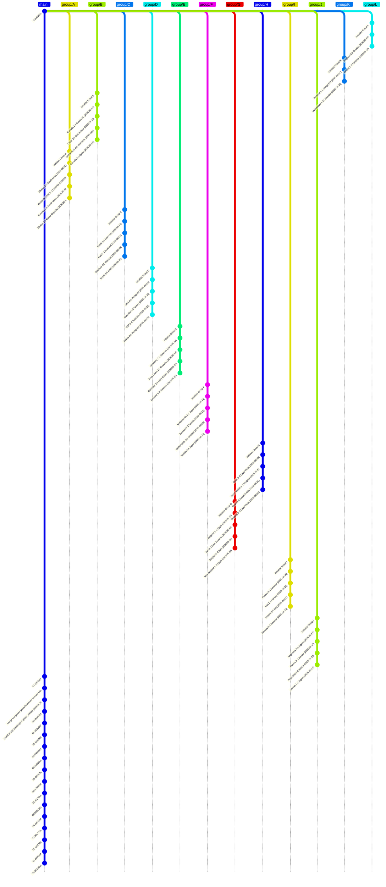

# 🏆 2026 FIFA World Cup in Git

This repository encodes the **2026 FIFA World Cup** as git history.

## How it works

| Branch | Content |
|--------|---------|
| `group/A` … `group/L` | Group stage — each match is a commit updating the standings |
| `teams/TLA` | Created for each of the 32 qualifiers after group stage |
| KO matches | Merge commits — winner's branch absorbs loser's, forming the bracket |
| `main` | Receives the final merge commit when the champion is crowned |

```bash
# View the full tournament bracket as a git graph
git log --graph --oneline --all
```

## Status

- **Stage**: Group Stage
- **Matches played**: 44 / 104
- **Last updated**: 2026-06-23 09:07 UTC

## Groups

- **Group A**: 4/6 played → `group/A`
- **Group B**: 4/6 played → `group/B`
- **Group C**: 4/6 played → `group/C`
- **Group D**: 4/6 played → `group/D`
- **Group E**: 4/6 played → `group/E`
- **Group F**: 4/6 played → `group/F`
- **Group G**: 4/6 played → `group/G`
- **Group H**: 4/6 played → `group/H`
- **Group I**: 4/6 played → `group/I`
- **Group J**: 4/6 played → `group/J`
- **Group K**: 2/6 played → `group/K`
- **Group L**: 2/6 played → `group/L`

## GitGraph (mermaid)



## Git Log

```text
* 59ccdf1 chore: update results (2026-06-23)
* 2e629c7 chore: update results (2026-06-23)
* 3c96f35 Update update_wc.py
* 18e174b Add mermaid graph generation to update_wc.py
* 06e0d4b Add assertion for group standings availability
* 256ba74 Update state.json
* 8cbf54e chore: update results (2026-06-23)
* 433deb6 chore: update results (2026-06-23)
* 970846b chore: update results (2026-06-23)
* be87bdb chore: update results (2026-06-23)
* edcdb1a chore: update results (2026-06-23)
* 0c8fb35 chore: update results (2026-06-22)
* 532ecf2 chore: update results (2026-06-22)
* a46e793 chore: update results (2026-06-22)
* 7131b1e chore: update results (2026-06-22)
* d829014 Refactor table row construction in update_wc.py
* cfe79c8 chore: update results (2026-06-22)
*   050e8d1 Merge pull request #10 from metaodi/copilot/add-github-repo-link
|\  
| * 0c9908e Use github_link variable with fallback for empty repo
| * a40e6c3 Add GitHub repository link on top of generated site
|/  
* d0348d9 Update update-results.yml
* d0e9e9c chore: update results (2026-06-22)
* 6a3d6aa Update update_wc.py
* 6539daa Improve logging of fetched standings
* 182bb74 Fix group reference in standings and merge logic
*   11a7899 Merge pull request #9 from metaodi/copilot/add-dry-run-option-update-wc
|\  
| * 36045b9 Improve workflow dry_run flag readability
| * 2a93b70 Add --dry-run option to update_wc.py and workflow_dispatch input
|/  
*   3da9dd8 Merge pull request #8 from metaodi/copilot/merge-group-branches-to-main
|\  
| * 9266698 fix: guard empty standings in group_merge_commit_msg, use check=False for merge --abort
| * b047f3d feat: merge completed group branches to main with standings in commit message
* | 1cb5603 Fix debug log to show complete standings result
|/  
* 1891b16 chore: update results (2026-06-22)
| * e30ca8e Group J, MD2: Jordan 1-2 Algeria (2026-06-23)
| * 173bd76 Group J, MD2: Argentina 2-0 Austria (2026-06-22)
| * 6353ded Group J, MD1: Austria 3-1 Jordan (2026-06-17)
| * adee0a8 Group J, MD1: Argentina 3-0 Algeria (2026-06-17)
| * dbf1358 feat: initialize Group J
|/  
| * c7aea2a Group I, MD2: Norway 3-2 Senegal (2026-06-23)
| * 4e6cfc4 Group I, MD2: France 3-0 Iraq (2026-06-22)
| * 00186db Group I, MD1: Iraq 1-4 Norway (2026-06-16)
| * 8d0cde8 Group I, MD1: France 3-1 Senegal (2026-06-16)
| * 890b13e feat: initialize Group I
|/  
| * 04ffccf Group G, MD2: New Zealand 1-3 Egypt (2026-06-22)
| * f7ad2d8 Group G, MD2: Belgium 0-0 Iran (2026-06-21)
| * 1a4358f Group G, MD1: Iran 2-2 New Zealand (2026-06-16)
| * 7a6b90c Group G, MD1: Belgium 1-1 Egypt (2026-06-15)
| * 95bc363 feat: initialize Group G
|/  
| * 353b949 Group H, MD2: Uruguay 2-2 Cape Verde (2026-06-21)
| * 465d211 Group H, MD2: Spain 4-0 Saudi Arabia (2026-06-21)
| * 5796282 Group H, MD1: Saudi Arabia 1-1 Uruguay (2026-06-15)
| * 7b76690 Group H, MD1: Spain 0-0 Cape Verde (2026-06-15)
| * c8fcf45 feat: initialize Group H
|/  
| * 2c293a1 Group F, MD2: Tunisia 0-4 Japan (2026-06-21)
| * ca13249 Group F, MD2: Netherlands 5-1 Sweden (2026-06-20)
| * a8afc11 Group F, MD1: Sweden 5-1 Tunisia (2026-06-15)
| * f3e36c2 Group F, MD1: Netherlands 2-2 Japan (2026-06-14)
| * 4158175 feat: initialize Group F
|/  
| * 7e8abe9 Group E, MD2: Ecuador 0-0 Curaçao (2026-06-21)
| * cbfbb9f Group E, MD2: Germany 2-1 Ivory Coast (2026-06-20)
| * 77005d7 Group E, MD1: Ivory Coast 1-0 Ecuador (2026-06-14)
| * 8abf54f Group E, MD1: Germany 7-1 Curaçao (2026-06-14)
| * ca1ba5a feat: initialize Group E
|/  
| * 133a7a0 Group D, MD2: Turkey 0-1 Paraguay (2026-06-20)
| * 7bc51e0 Group D, MD2: USA 2-0 Australia (2026-06-19)
| * 479f0c9 Group D, MD1: Australia 2-0 Turkey (2026-06-14)
| * dc41a77 Group D, MD1: USA 4-1 Paraguay (2026-06-13)
| * 9c6f98b feat: initialize Group D
|/  
| * d7ab31f Group C, MD2: Brazil 3-0 Haiti (2026-06-20)
| * 7f92332 Group C, MD2: Scotland 0-1 Morocco (2026-06-19)
| * aaa0288 Group C, MD1: Haiti 0-1 Scotland (2026-06-14)
| * 188d78f Group C, MD1: Brazil 1-1 Morocco (2026-06-13)
| * c414e3e feat: initialize Group C
|/  
| * c4228f1 Group A, MD2: Mexico 1-0 Korea Republic (2026-06-19)
| * 39b5627 Group A, MD2: Czechia 1-1 South Africa (2026-06-18)
| * 3233280 Group A, MD1: Korea Republic 2-1 Czechia (2026-06-12)
| * fa75150 Group A, MD1: Mexico 2-0 South Africa (2026-06-11)
| * 47bebfc feat: initialize Group A
|/  
| * 959b5ec Group B, MD2: Canada 6-0 Qatar (2026-06-18)
| * f0f2085 Group B, MD2: Switzerland 4-1 Bosnia-H. (2026-06-18)
| * 17518a8 Group B, MD1: Qatar 1-1 Switzerland (2026-06-13)
| * 6e8ebe8 Group B, MD1: Canada 1-1 Bosnia-H. (2026-06-12)
| * d54f39c feat: initialize Group B
|/  
| * a18c655 Group K, MD1: Uzbekistan 1-3 Colombia (2026-06-18)
| * 2535b78 Group K, MD1: Portugal 1-1 Congo DR (2026-06-17)
| * a45469d feat: initialize Group K
|/  
| * 0b5f924 Group L, MD1: Ghana 1-0 Panama (2026-06-17)
| * ce6e417 Group L, MD1: England 4-2 Croatia (2026-06-17)
| * dbbafc3 feat: initialize Group L
|/  
* 83ec9d8 Reset processed_ids and update starting_commit
* 0a9f96b Update update_wc.py
```