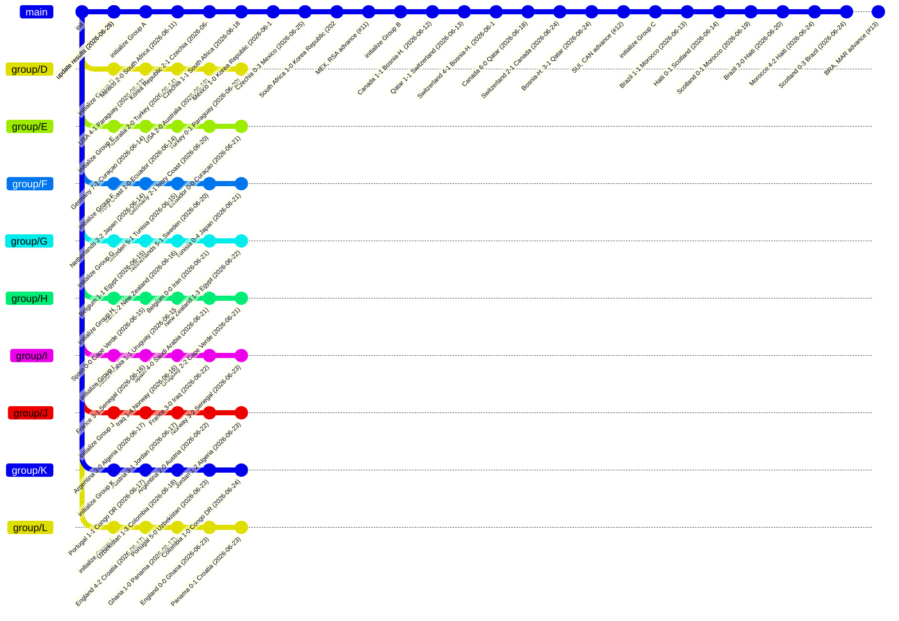

# 🏆 2026 FIFA World Cup in Git

This repository encodes the **2026 FIFA World Cup** as git history.

## How it works

| Branch | Content |
|--------|---------|
| `group/A` … `group/L` | Group stage — each match is a commit updating the standings |
| `teams/TLA` | Created for each of the 32 qualifiers after group stage |
| KO matches | Merge commits — winner's branch absorbs loser's, forming the bracket |
| `main` | Receives the final merge commit when the champion is crowned |

```bash
# View the full tournament bracket as a git graph
git log --graph --oneline --all
```

## Status

- **Stage**: Group Stage
- **Matches played**: 54 / 104
- **Last updated**: 2026-06-25 07:42 UTC

## Groups

- **Group A**: 6/6 played → `group/A`
- **Group B**: 6/6 played → `group/B`
- **Group C**: 6/6 played → `group/C`
- **Group D**: 4/6 played → `group/D`
- **Group E**: 4/6 played → `group/E`
- **Group F**: 4/6 played → `group/F`
- **Group G**: 4/6 played → `group/G`
- **Group H**: 4/6 played → `group/H`
- **Group I**: 4/6 played → `group/I`
- **Group J**: 4/6 played → `group/J`
- **Group K**: 4/6 played → `group/K`
- **Group L**: 4/6 played → `group/L`

## GitGraph (mermaid)



## Git Log

```text
* 20bb335 Update state.json
*   1853711 Group C: BRA, MAR advance (#13)
|\  
| * 1e63230 Group C, MD3: Scotland 0-3 Brazil (2026-06-24)
| * 914859e Group C, MD3: Morocco 4-2 Haiti (2026-06-24)
| * 713ade3 Group C, MD2: Brazil 3-0 Haiti (2026-06-20)
| * 1ea95ac Group C, MD2: Scotland 0-1 Morocco (2026-06-19)
| * cae8412 Group C, MD1: Haiti 0-1 Scotland (2026-06-14)
| * 4c1fb49 Group C, MD1: Brazil 1-1 Morocco (2026-06-13)
| * de0ccc8 feat: initialize Group C
*   582cdde Group B: SUI, CAN advance (#12)
|\  
| * 0a60654 Group B, MD3: Bosnia-H. 3-1 Qatar (2026-06-24)
| * c1e4c7e Group B, MD3: Switzerland 2-1 Canada (2026-06-24)
| * 3357170 Group B, MD2: Canada 6-0 Qatar (2026-06-18)
| * 2f0881b Group B, MD2: Switzerland 4-1 Bosnia-H. (2026-06-18)
| * d12dfee Group B, MD1: Qatar 1-1 Switzerland (2026-06-13)
| * 647c3f3 Group B, MD1: Canada 1-1 Bosnia-H. (2026-06-12)
| * 73fea82 feat: initialize Group B
*   2601f9a Group A: MEX, RSA advance (#11)
|\  
| * fb7d903 Group A, MD3: South Africa 1-0 Korea Republic (2026-06-25)
| * 1276260 Group A, MD3: Czechia 0-3 Mexico (2026-06-25)
| * f768041 Group A, MD2: Mexico 1-0 Korea Republic (2026-06-19)
| * dbc69ea Group A, MD2: Czechia 1-1 South Africa (2026-06-18)
| * 777a2b6 Group A, MD1: Korea Republic 2-1 Czechia (2026-06-12)
| * 612b691 Group A, MD1: Mexico 2-0 South Africa (2026-06-11)
| * b22d60b feat: initialize Group A
* e5c328e chore: update results (2026-06-25)
* 63ecdfc Update update_wc.py
* 2452db4 chore: update results (2026-06-25)
* 09b3863 Update update_wc.py
* 58eaddf Update update_wc.py
* d795d15 chore: update results (2026-06-25)
* 766e2f9 chore: update results (2026-06-24)
* 44b4375 chore: update results (2026-06-24)
* c9ac0a0 Disable scheduled updates for World Cup results
* 3363bd4 chore: update results (2026-06-24)
* 33f3158 chore: update results (2026-06-24)
* 69a9d9b chore: update results (2026-06-24)
* e9982f7 Update update_wc.py
* d97b331 chore: update results (2026-06-24)
* e5a5a17 Add commit id to gitGraph command output
* e1b30f2 chore: update results (2026-06-24)
* ef8924b chore: update results (2026-06-24)
* 9b9ffa2 chore: update results (2026-06-24)
* e8d508e chore: update results (2026-06-23)
* 211ffde Update update_wc.py
* a4c4ecc chore: update results (2026-06-23)
* 0dae92a chore: update results (2026-06-23)
* b4349ce Update state.json
* 28444af chore: update results (2026-06-23)
* 0226e32 Allow display of chore commits in update_wc.py
* 0827645 Update starting_commit in state.json
* e37f30d chore: update results (2026-06-23)
* f027d96 Update starting_commit in state.json
* 9bb0204 chore: update results (2026-06-23)
* c6254c2 Update starting_commit in state.json
* 795f227 chore: update results (2026-06-23)
* 2eb25c8 Update starting_commit to new commit hash
* f5de9cc Group K, MD2: Colombia 1-0 Congo DR (2026-06-24)
* 6143609 Group K, MD2: Portugal 5-0 Uzbekistan (2026-06-23)
* 03093dc Group K, MD1: Uzbekistan 1-3 Colombia (2026-06-18)
* 9e313b3 Group K, MD1: Portugal 1-1 Congo DR (2026-06-17)
* 682f112 feat: initialize Group K
* 7551de5 Group L, MD2: Panama 0-1 Croatia (2026-06-23)
* 6a430be Group L, MD2: England 0-0 Ghana (2026-06-23)
* ab54662 Group L, MD1: Ghana 1-0 Panama (2026-06-17)
* 9709b5e Group L, MD1: England 4-2 Croatia (2026-06-17)
* 4ece383 feat: initialize Group L
* 64f56fa Group J, MD2: Jordan 1-2 Algeria (2026-06-23)
* a04bce5 Group J, MD2: Argentina 2-0 Austria (2026-06-22)
* d62db80 Group J, MD1: Austria 3-1 Jordan (2026-06-17)
* 555de8f Group J, MD1: Argentina 3-0 Algeria (2026-06-17)
* 26d1524 feat: initialize Group J
* 5a0f84e Group I, MD2: Norway 3-2 Senegal (2026-06-23)
* 40fce23 Group I, MD2: France 3-0 Iraq (2026-06-22)
* 432ca77 Group I, MD1: Iraq 1-4 Norway (2026-06-16)
* 769feea Group I, MD1: France 3-1 Senegal (2026-06-16)
* a28079d feat: initialize Group I
* 041ba94 Group H, MD2: Uruguay 2-2 Cape Verde (2026-06-21)
* 4187777 Group H, MD2: Spain 4-0 Saudi Arabia (2026-06-21)
* b8d1966 Group H, MD1: Saudi Arabia 1-1 Uruguay (2026-06-15)
* 0d818f0 Group H, MD1: Spain 0-0 Cape Verde (2026-06-15)
* ea91a7b feat: initialize Group H
* 1aa234b Group G, MD2: New Zealand 1-3 Egypt (2026-06-22)
* 9a649da Group G, MD2: Belgium 0-0 Iran (2026-06-21)
* 4198b88 Group G, MD1: Iran 2-2 New Zealand (2026-06-16)
* 7f1d992 Group G, MD1: Belgium 1-1 Egypt (2026-06-15)
* 9ba404e feat: initialize Group G
* 37486e3 Group F, MD2: Tunisia 0-4 Japan (2026-06-21)
* 62cfd94 Group F, MD2: Netherlands 5-1 Sweden (2026-06-20)
* a3802dd Group F, MD1: Sweden 5-1 Tunisia (2026-06-15)
* 55a2a87 Group F, MD1: Netherlands 2-2 Japan (2026-06-14)
* f136fe6 feat: initialize Group F
* 54ae035 Group E, MD2: Ecuador 0-0 Curaçao (2026-06-21)
* fd81778 Group E, MD2: Germany 2-1 Ivory Coast (2026-06-20)
* 7948bbe Group E, MD1: Ivory Coast 1-0 Ecuador (2026-06-14)
* 6256d77 Group E, MD1: Germany 7-1 Curaçao (2026-06-14)
* cd1b6fc feat: initialize Group E
* e28a6dc Group D, MD2: Turkey 0-1 Paraguay (2026-06-20)
* f307f62 Group D, MD2: USA 2-0 Australia (2026-06-19)
* d9483dc Group D, MD1: Australia 2-0 Turkey (2026-06-14)
* 3829793 Group D, MD1: USA 4-1 Paraguay (2026-06-13)
* da0de21 feat: initialize Group D
```